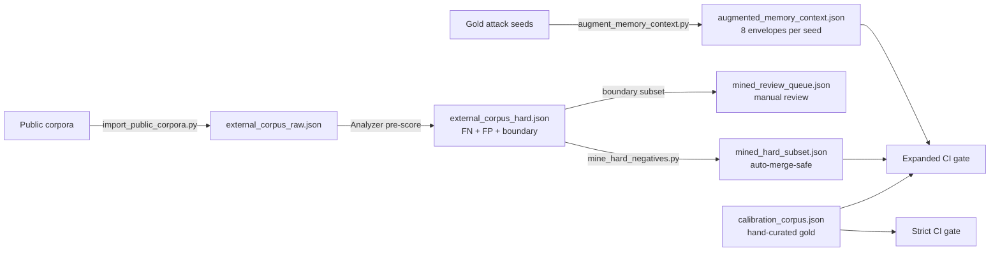

# Corpus tiers

Memgar separates calibration data into **five tiers** so the gold set stays
clean, auto-generated data is auditable, and the CI gate never regresses.

| Tier | File | Source | Reviewed | Used by |
|---|---|---|---|---|
| **Gold** | `ml/data/calibration_corpus.json` | hand-curated | yes | CI gate (strict, 8 thresholds) |
| **Mined** | `ml/data/mined_hard_subset.json` | auto from public-corpus FN/FP | algorithmic | Expanded gate |
| **Augmented** | `ml/data/augmented_memory_context.json` | template wrappers on seeds | deterministic | Expanded gate |
| **Review** | `ml/data/mined_review_queue.json` | boundary cases | pending | manual import only |
| **Raw** | `ml/data/external_corpus_raw.json` | full public-corpus dump | none | reference only |

## Why separate tiers?

The first version of memgar's calibration had a single `calibration_corpus.json`
that anyone could append to. Two failure modes:

1. **Distribution drift**: a contributor appended 500 "fake news" prompts
   (legitimate research data) and the gate started rewarding pattern matches
   on words like "fact-check".
2. **Self-referential bias**: memgar started passing its own test corpus
   because the corpus grew to match the patterns rather than the reverse.

Tier separation forces an explicit promotion step from auxiliary →
manually-reviewed → gold, and lets the CI gate run TWO calibrations:

- **Strict gate** — gold only. Must always PASS. Prevents regression.
- **Expanded gate** — gold + auxiliary. Looser thresholds, but tracks
  memgar's actual behaviour on harder real-world distributions.

## Public corpora ingested

| Source | Lic | Rows | Default | Notes |
|---|---|---|---|---|
| AdvBench (Zou et al.) | MIT | 520 | yes | Out-of-scope rows tagged |
| JailbreakBench harmful | MIT | 64 | yes | Filtered categories |
| JailbreakBench benign | MIT | 100 | yes | Gold for FP calibration |
| HarmBench (CAIS) | MIT | 69 | yes | Cyber + disinfo only |
| Lakera Gandalf | MIT | 1000 | yes | Real prompt-injection attempts |
| deepset/prompt-injections | Apache-2.0 | 662 | yes | EN benign + attack mixed |
| TrustAIRLab in-the-wild jailbreaks | MIT | 1364 | yes | Real DAN/Discord harvest |
| WildJailbreak (AI2) | ODC-BY | ~2000 | opt-in (gated, needs HF_TOKEN) | Adversarial benign + harmful |
| TrustAIRLab regular | MIT | 1500 | opt-in (false-benign risk) | Mostly persona-injection templates |

## Pipeline

## Promoting auxiliary → gold

Manual review only. Open `mined_review_queue.json`, inspect each row,
decide:

- **Approve as attack** (`label=1`): copy into `calibration_corpus.json`
- **Approve as benign** (`label=0`): same
- **Skip** (ambiguous, edge case): leave in review file

After promotion, re-run the gold calibration and update the relevant
threshold in `check_calibration_gate.py` if coverage has materially improved.

## Anti-overfit guardrails

- `mine_hard_negatives.py --top-n-fn 5` caps how many FNs per category enter
  the auto-merge subset, preventing any single threat type from dominating.
- TF-IDF cosine dedup at threshold 0.85 strips near-duplicates so the model
  doesn't memorize one specific phrasing.
- `mined_review_queue.json` (boundary cases) is never auto-promoted — those
  are the highest-information-rate samples and need a human call.
