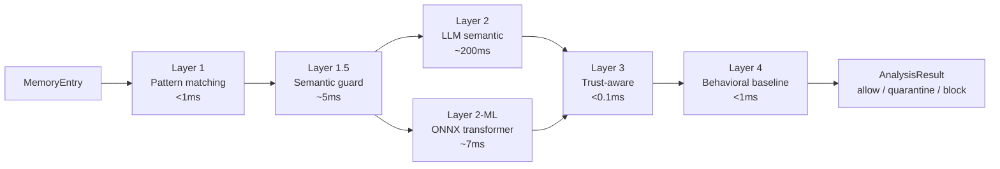
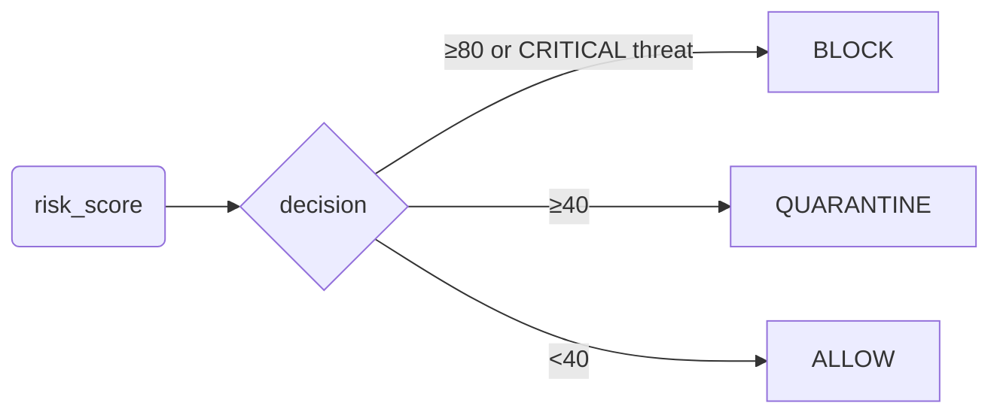

# Architecture overview

Memgar runs a 4-layer pipeline on every memory write or retrieval chunk.
Layers are independent — one failure does not silently disable the others.
Every layer's state is queryable via `Analyzer.health_check()`.

## Layer table

| Layer | Latency | Default | Disabled gracefully? |
|---|---|---|---|
| **1** Pattern matching | <1ms | always on | n/a |
| **1.5** SemanticGuard (embeddings) | ~5ms | optional | yes (centroids missing) |
| **2** LLM semantic (Claude) | ~200ms | opt-in `use_llm=True` | yes (no API key) |
| **2-ML** Transformer (ONNX) | ~7ms | active if artifact present | yes (no artifact) |
| **3** Trust-aware scoring | <0.1ms | auto when source registered | n/a |
| **4** Behavioral baseline | <1ms | auto per-agent after warm-up | n/a |

## Layer details

**Layer 1** (`_layer1_pattern_matching`) — Regex + keyword matching against
770+ threat patterns loaded from `memgar/patterns.py`. Pickle-cached so
cold-start drops from ~3500ms to ~3ms.

**Layer 1.5** (`SemanticGuard`) — Cosine similarity against threat-category
centroids built from sentence-transformers embeddings. When the centroid file
is missing the layer reports `status=degraded` with a one-time WARNING log,
returns `0.0` for every input, and Analyzer drops it from the pipeline so the
call cost is zero.

**Layer 2** (`_layer2_semantic_analysis`) — Optional Claude LLM call for
sophisticated attacks (obfuscation, roleplay framing, multi-step persuasion).
Runs independently of Layer 1, so attacks that beat regex still get caught.

**Layer 2-ML** (`TransformerDetector`) — Fine-tuned BERT-mini (~11M params)
exported to ONNX. ~7ms inference, ~45MB FP32 / ~12MB int8. Memgar ships
without a pre-trained artifact (see [training](../development/training.md))
because the default training data does not match production traffic. Bring
your own dataset and train in ~2 minutes on CPU.

**Layer 3** (`_analyze_internal`, after risk score) — Source trust
adjustment. Call `analyzer.register_source_trust(source_id, 0.0-1.0)` before
analyzing. Low trust (`<0.3`) boosts risk by up to +30 points; high trust
(`>=0.8`) reduces borderline scores by 5 points.

**Layer 4** (`analyze`, after `_analyze_internal`) — Per-agent
`BehavioralBaseline` observes scan-risk and scan-block-rate. If current
signals deviate `SUSPICIOUS` (+15pts) or `CRITICAL` (+30pts) from the
agent's learned baseline, risk is elevated. Only amplifies existing threat
signals — never flags `risk_score=0` content.

## Decision boundary

Override via `MemgarConfig.analysis.fail_close=true` to escalate ALLOW →
QUARANTINE whenever any ML layer is degraded.

## Why this composition

Single-model defenses (e.g. one fine-tuned classifier) have a brittleness
problem: any input that bypasses the classifier passes through. Memgar's
pipeline is **defense in depth**:

- Layer 1 catches the obvious cases (known prompts, exfil verbs).
- Layer 1.5 catches semantic siblings ("disregard the directives above").
- Layer 2/2-ML catches obfuscated attacks (homoglyph, leetspeak, base64).
- Layer 3 weights by source provenance.
- Layer 4 raises the bar on anomalous agents.

An attacker has to defeat **every** layer, not one. Each layer also reports
its own health, so the operator knows immediately when the defense degrades.

## Next

- [4-Layer pipeline (deeper)](pipeline.md)
- [Threat categories](threats.md)
- [Corpus tiers](corpus.md)
