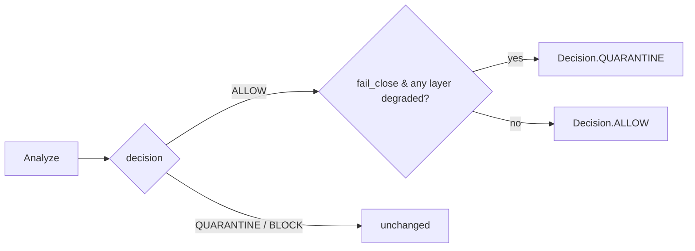

# Configuration

All settings live in `MemgarConfig` and can be set via YAML, environment
variables, or constructor args.

## Environment variables

| Variable | Default | Effect |
|---|---|---|
| `MEMGAR_FEED_ENABLED` | `true` | Pull signed threat feed at startup |
| `MEMGAR_FEED_MAX_AGE_DAYS` | `7` | Stale cache age before re-fetch |
| `MEMGAR_FEED_GITHUB_REPO` | `slcxtor/memgar` | Where to fetch the signed bundle |
| `MEMGAR_OBSERVABILITY_ENABLED` | `false` | Run Prometheus + drift monitor |
| `MEMGAR_OBSERVABILITY_PORT` | `9090` | Prometheus scrape port |
| `MEMGAR_OBSERVABILITY_DRIFT_THRESHOLD` | `0.20` | PSI threshold for drift alerts |
| `MEMGAR_OBSERVABILITY_DRIFT_WINDOW` | `1000` | Window of scans for drift baseline |
| `MEMGAR_CACHE_DIR` | `~/.cache/memgar` | Pattern cache + feed cache root |
| `MEMGAR_FAIL_CLOSE` | `false` | Escalate ALLOW → QUARANTINE when ML/feed degraded |
| `MEMGAR_TRANSFORMER_THRESHOLD` | `0.92` | Min ONNX prob to fire ML-DETECT signal |

## YAML config

```yaml
# memgar.yaml
analysis:
  fail_close: true                 # MEMGAR_FAIL_CLOSE equivalent
  use_llm: false
  semantic_guard: true
  use_transformer_ml: true

feed:
  enabled: true
  max_age_days: 7
  github_repo: slcxtor/memgar

observability:
  enabled: true
  port: 9090
  drift_threshold: 0.2
  drift_window: 1000
```

Load with:

```python
from memgar.config import MemgarConfig
cfg = MemgarConfig.from_yaml("memgar.yaml")
```

## Constructor overrides

Constructor args take precedence over both YAML and env vars:

```python
from memgar import Analyzer

a = Analyzer(
    use_llm=False,
    fail_close=True,             # overrides MEMGAR_FAIL_CLOSE
    semantic_guard=True,
    use_transformer_ml=True,
    strict_mode=False,
    use_whitelist=True,
    use_sliding_window=True,
    window_size=1000,
    window_overlap=200,
    correlation_detector=True,
    ensemble_voter=True,
    similarity_layer=True,
)
```

## fail_close decision



When fail_close fires, the explanation is prefixed with
`[fail_close] Escalated ALLOW→QUARANTINE: 2 layer(s) degraded (layer1.5_semantic_guard, threat_feed). ...`
so operators can see exactly which signal was missing.

## Per-source trust

```python
a.register_source_trust("openai-api",      0.95)
a.register_source_trust("user-form",       0.40)
a.register_source_trust("untrusted-wiki",  0.10)
```

Trust is purely operator-defined — memgar never silently learns trust from
behaviour. Auto-learned trust would be its own attack surface.
